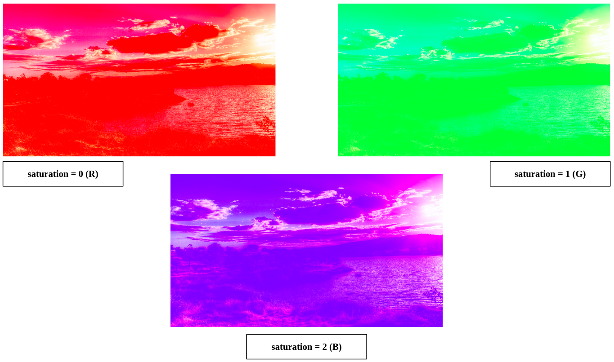
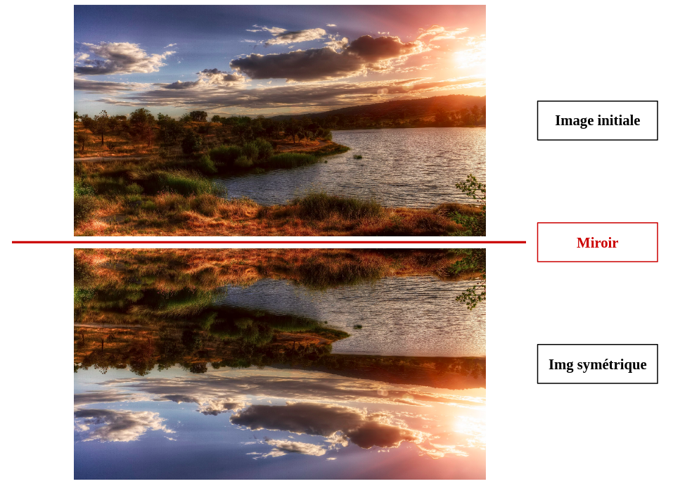
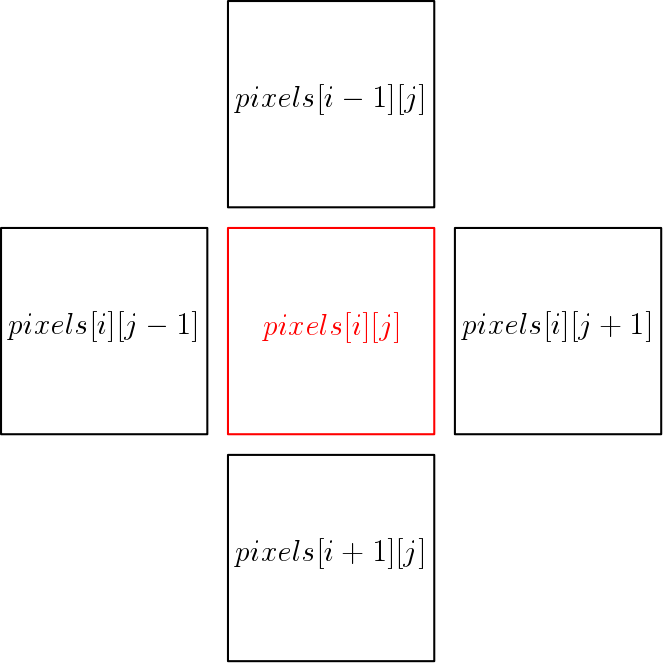

# Image_Processing
This project is held during the APM (Architecture et programmation d'accélérateurs) lectures and aimed at image processing using GPU (CUDA). 

- Compression of the input image to a table of bits using *FreeImage* library (Library installed and added to the environment)
- Done using the supercomputer *ROMEO*

## Compilation and execution of the program

The project is compiled using a Makefile. 

### Load modules

To load the necessary modules :

	source env.sh
	
### Compilation

To compile the program :

	make all
	
### Execution

The execution of the program is done using slurm, as follows :

	sbatch carte_job.sh

Two files are then generated: an error file, containing the erros -if any-, and an output file, containing the output prints. The input test image is given inside the *src* folder, and the new image will be also stored in the same folder.

## Questions Description and Results

### Question 6 : Pixels Saturation of the image

This question consists in saturating each pixel of the input test image among R (Red), G (Green) or B (Blue). To do this, an integer variable "saturation" is defined and takes the values: 0 if R, 1 if G or 2 if G. The execution of the program leads to the following results:

### Question 7 : Horizontal Symmetry of the image

This question consists in doing an horizontal symmetry of an input image, in our case the test image. The output image after the code execution is an horizontally symmetric image as shown hereunder.

### Question 8 : Blur image

In this question, the kernel making a blur on the image is implemented. To do so, the value of a pixel is updated using the average values of this later and its neighbors, as shown in the figure below.

img {
  display: block;
  margin: auto;
}

