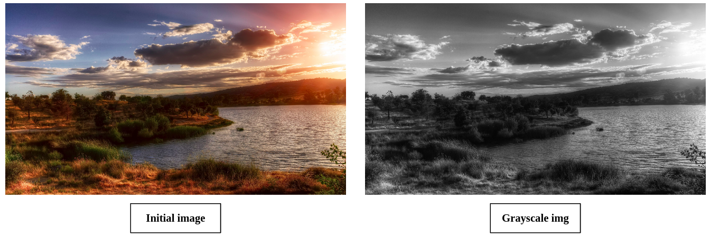

# Image_Processing
This project is held during the APM (Architecture et programmation d'accélérateurs) lectures and aimed at image processing using GPU (CUDA).

- Realised by : Aicha Maaoui (Myself). 

- Compression of the input image to a table of pixels using *FreeImage* library (Library installed and added to the environment)

- Compiled and executed using the supercomputer *ROMEO*

## Compilation and execution of the program

The project is compiled using a Makefile. 

### STEP 1 : Load modules

To load the necessary modules :

	source env.sh
	
### STEP 2 : Compilation

To compile the program :

	make all
	
### STEP 3 : Execution

The execution of the program is done using slurm, as follows :

	sbatch carte_job.sh

Two files are then generated: an error file, containing the erros -if any-, and an output file, containing the output prints. The input test image is put before compilation inside the *src* folder, and the new image will be also stored in the same folder (random choice).

### Content Description

The program content is described as follows :

* **Main program :** *src/modif_img.cpp* (contains all headers)

* **Question 6 (Pixels Saturation of the image):**  implemented in *src/mykernel_pixel_saturation.cu* and *inc/mykernel_pixel_saturation.h*

* **Question 7 (Horizontal Symmetry of the image):** implemented in *src/mykernel_horizontal_symmetry.cu* and *inc/mykernel_horizontal_symmetry.h*

* **Question 8 (Blur image) :** implemented in *src/mykernel_blur_image.cu* and *inc/mykernel_blur_image.h*

* **Question 9 (Grayscaled image) :** implemented in *src/mykernel_grayscale.cu* and *inc/mykernel_grayscale.h*

* **Question 10 (Sobel Filter) :** implemented in *src/mykernel_sobel.cu* and *inc/mykernel_sobel.h*

* **Question 11-a (Resizing the image) :** implemented in *src/mykernel_resize.cu* and *inc/mykernel_resize.h*

* **Question 11-b (Image rotation) :** implemented in *src/mykernel_rotation.cu* and *inc/mykernel_rotation.h*

* **Question 11 - c (Diapositive effect) :** implemented in *src/mykernel_diapositive.cu* and *inc/mykernel_diapositive.h

* **Question 11 - d (Keeping only one null pixel component) :** implemented in *src/mykernel_one_pixel.cu* and *inc/mykernel_one_pixel.h*

* **Question 11 - e (Canny Filter) :** implemented in *src/mykernel_canny_filter.cu* and *inc/mykernel_canny_filter.h*

* **Question 12 (PopArt effect) :** implemented in *src/mykernel_popArt.cu* and *inc/mykernel_popArt.h*

* **Question 13:** Is the code efficient? Modifications? : Response at the end of this readme.

* **Question 14:** PopArt effect with 4 streams : implemented in *src/mykernel_popArt_4streams.cu* and *inc/mykernel_popArt_4streams.h*

## Questions Description and Results

### Question 6 : Pixels Saturation of the image

This question consists in saturating each pixel of the input test image among R (Red), G (Green) or B (Blue). To do this, an integer variable "saturation" is defined and takes the values: 0 if R, 1 if G or 2 if G. This question is implemented in *src/mykernel_pixel_saturation.cu* and *inc/mykernel_pixel_saturation.h*. The execution of the program leads to the following results:

### Question 7 : Horizontal Symmetry of the image

This question consists in doing an horizontal symmetry of an input image, in our case the test image. The output image after the code execution is an horizontally symmetric image as shown hereunder. This question is implemented in *src/mykernel_horizontal_symmetry.cu* and *inc/mykernel_horizontal_symmetry.h*.

### Question 8 : Blur image

In this question, the kernel making a blur on the image is implemented. To do so, the value of a pixel is updated using the average values of this later and its neighbors, as shown in the figure below. This question is implemented in *src/mykernel_blur_image.cu* and *inc/mykernel_blur_image.h*.

### Question 9 : Grayscaled image

In this question, the initial image is modified into a grayscaled one. The result is given hereunder. This question is implemented in *src/mykernel_grayscale.cu* and *inc/mykernel_grayscale.h*.

### Question 10 : Sobel Filter

In this question, the sobel filter is applied to modify the image in such a way the edges are colored in white on a black background. The filter calculates the gradient of the image intensity at each pixel location.

Both kernel versions using global and shared memory are applied. Fixing the threshold, determining the min value of a pixel to be considered as an edge, equal to 90 and the padding to 2, we obtain the following image. This question is implemented in *src/mykernel_sobel.cu* and *inc/mykernel_sobel.h*.

### Question 11-a: Resizing the image

In this question, the image is resized according to a scale factor *SCALE_FACTOR*. In the implemented code, the scale factor is set to 0.5. his question is implemented in *src/mykernel_resize.cu* and *inc/mykernel_resize.h*. The result is given below. 

Note: In case you want to execute this code, uncomment code lines between "Question 11-a" and "END Question 11 - a" and comment the rest of the code lines in *src/modif_img.cpp*.

### Question 11-b: Image rotation

In this question, the image is rotated with an angle in deg. In the implemented code, the angle is set to 80deg. This question is implemented in *src/mykernel_rotation.cu* and *inc/mykernel_rotation.h*. For an example for rotation (angle 90 and 80 degrees), the result is given below. It should be noted that thought the rotation is done, the new width and height of the image are not computed correctly. The formula were given in a comment, however due to limited time no further investigation has been performed.

Note: In case you want to execute this code, uncomment code lines between "Question 11-b" and "END Question 11 - b" and comment the rest of the code lines in *src/modif_img.cpp*.

### Question 11 - c: Diapositive effect

In this question, we apply (c-255) to each component of the pixel c. This question is implemented in *src/mykernel_diapositive.cu* and *inc/mykernel_diapositive.h*. The resulting image is shown here-under.

### Question 11 - d: Keeping only one null pixel component

In this question, we keep only one null pixel component (red) while the other pixel components (green, blue) are null. This question is implemented in *src/mykernel_one_pixel.cu* and *inc/mykernel_one_pixel.h*. The resulting image is shown here-under.

### Question 11 - e: Canny Filter

In this question, the different steps of the Canny filter are implemented. This question is implemented in *src/mykernel_canny_filter.cu* and *inc/mykernel_canny_filter.h*. The resulting image is shown here-under.

### Question 12: PopArt effect

In this question, the image is divided into 4 equal frames, each is modified differently. This question is implemented in *src/mykernel_popArt.cu* and *inc/mykernel_popArt.h*.

### Question 13: Is the code efficient? Modifications?

The implemented code divides the image into 4 quadrants, to each modifications will be performed (saturation of the color). While now it is only executed on the default stream, which is stream 0, each (1/4)th of the image frame could be executed in a different stream, making it a total of 4 streams.

* Default stream (s0) : (t1) : bottom-left -> (t2) : bottom-right -> (t3) : top-left -> (t4) : top-right. 
* After : (t1) : (s0) = bottom-left, (s1) = bottom-right, (s2) : top-left, (s3) : top-right

Using 4 streams, the modifications could be executed in parallel. Thus, we can make use of the parallel potentiel of GPU and reduce the amount of computation time.

### Question 14: PopArt effect with 4 streams

In this question, the image is divided into 4 equal frames, where each stream applied modifications on one frame. This question is implemented in *src/mykernel_popArt_4streams.cu* and *inc/mykernel_popArt_4streams.h*.

